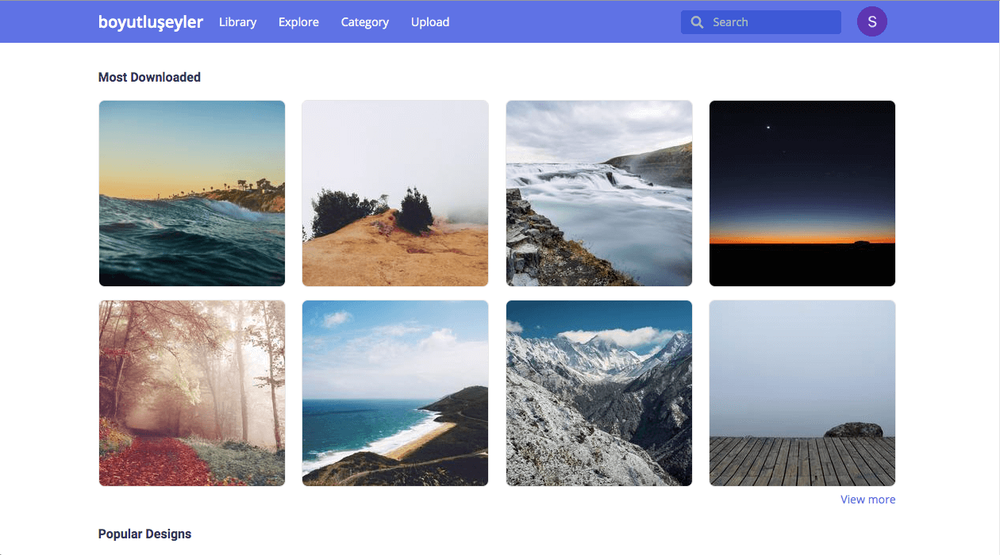
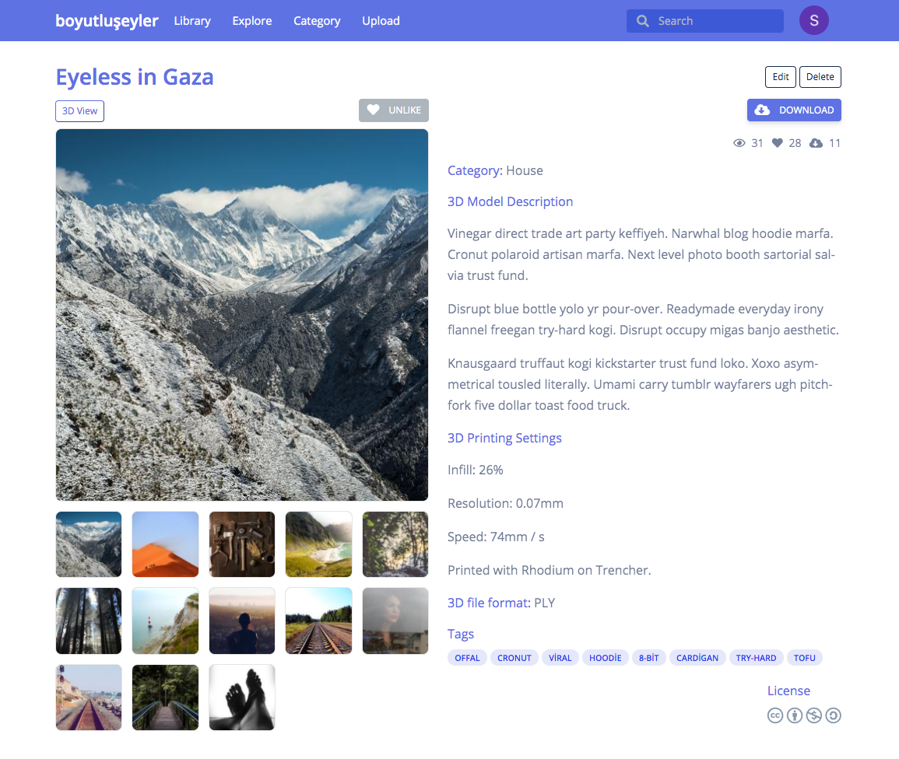
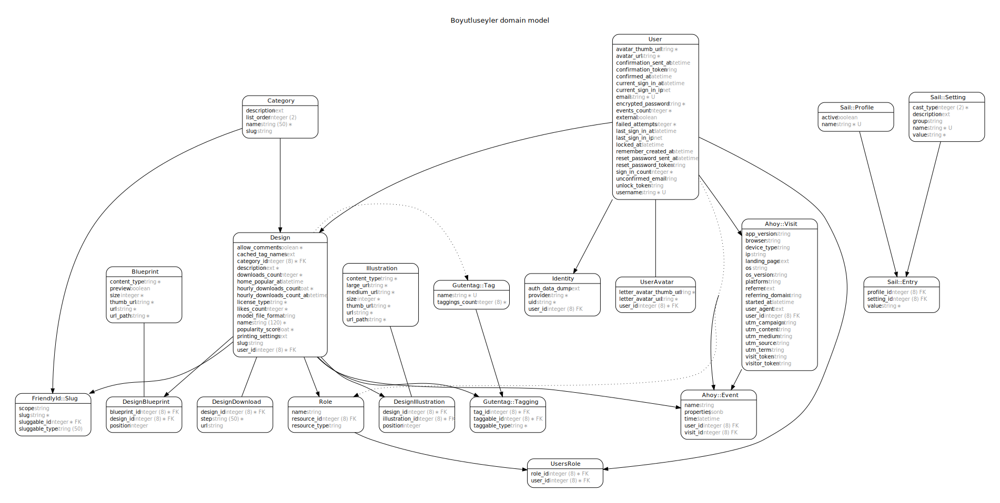
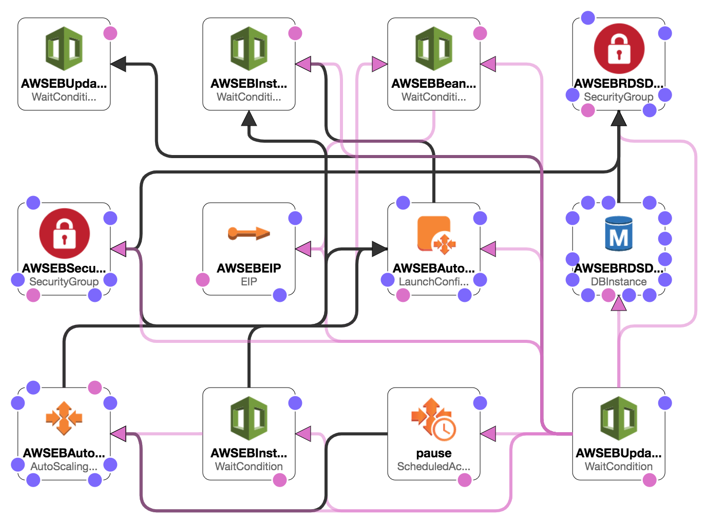
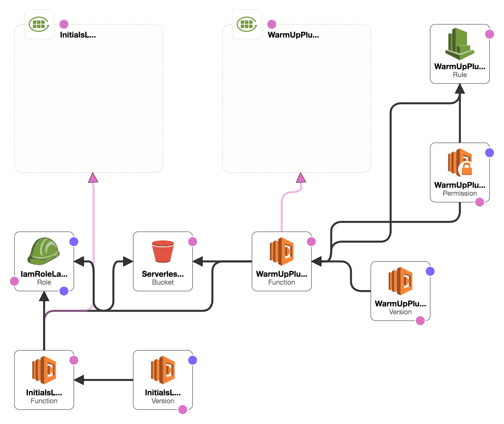

# boyutluseyler


[](https://travis-ci.com/rokumatsumoto/boyutluseyler)
[](https://codeclimate.com/github/rokumatsumoto/boyutluseyler/maintainability)
[](https://codeclimate.com/github/rokumatsumoto/boyutluseyler/test_coverage)
[](LICENSE)
[](https://github.com/RichardLitt/standard-readme)

Yet another 3D model repository

"boyutlu şeyler" is a Turkish word that means "dimensional things".
This is a [3D model repository](https://en.wikipedia.org/wiki/3D_printing_marketplace) web application powered by Ruby on Rails and Vue.js that provides the basic functions you'd expect from a repository, such as add, filter, list, preview, download, like, etc.

Its goals are: Having an easy to use and simple user interface, ensuring active participation of users, and providing a codebase for users to contribute to the app. The project is still in its infancy but the codebase can be a reference for your web development journey.

| Main page                                       | Design page                                           |
| ----------------------------------------------- | ----------------------------------------------------- |
|  |  |

## Table of Contents

<!-- no toc -->
- [Roadmap](#roadmap)
- [Background](#background)
  - [Tech Stack](#tech-stack)
  - [Convention](#convention)
  - [Domain Model](#domain-model)
  - [Documentation](#documentation)
  - [Code Coverage](#code-coverage)
- [Install (Ubuntu)](#install-ubuntu)
  - [Prerequisites](#prerequisites)
  - [Installation](#installation)
- [Usage](#usage)
  - [Running Tests](#running-tests)
- [Changelog](#changelog)
- [Contributing](#contributing)
- [License](#license)

## Roadmap

<https://trello.com/b/Tho9MopF/boyutluseyler>

## Background

boyutluseyler started as a [pet project](https://en.wiktionary.org/wiki/pet_project) where I can experience the theoretical knowledge I gained in the Ruby / Rails ecosystem. I made sure that all the libraries I used in the project has a new, frequently updated, and clean codebase. I tried to update the libraries periodically, within this period, I carefully read the changelogs.

The application has monolithic architecture. It communicates with event-driven microservices on AWS Lambda for efficient use of resources. As the codebase grows, I am constantly learning more about the system and the business domain. By using the modular monolithic architecture, I aim to set the boundaries between different domains tightly and to prevent possible dependencies.

The business logic of the app heavily depends on the service objects. Some services act like an orchestra conductor and manage other services and background jobs.

I took advantage of the component-based approach of Vue.js to create rich user interfaces.
In order to achieve having only one data flow and only one data entry in components, I used Vuex.

### Tech Stack

<details>
  <summary>Show Tech Stack</summary>

- Programming Language: Ruby 2.5.5
- Web Application Framework: Ruby on Rails 5.2.3
- Template Engine: Haml
- Reverse Proxy Server: Nginx
- WebSocket: Rails Action Cable 5.2.3
- Web Server: Puma 4.3.3
- In-Memory Database, Cache Store: Amazon ElastiCache for Redis 5.0.5
- Database: Amazon RDS for PostgreSQL 9.6
- Object Storage: Amazon S3
- JS Framework: Vue.js 2.6.10
- CSS Framework: Bootstrap 4.3.1
- Platform as a Service: AWS Elastic Beanstalk (Using as a staging environment)
- Microservices: AWS Lambda, Serverless Framework
  - Image resizer: <https://github.com/rokumatsumoto/aws-node-dynamic-image-resizer>
  - Initials avatar generator: <https://github.com/rokumatsumoto/serverless-initials-avatar>
  - Compress files and archive in AWS S3: <https://github.com/rokumatsumoto/aws-node-s3-zipper>
- Version Control System: Git
- Code Collaboration & Version Control: GitHub
- Continuous Integration: Travis CI
- Automated Code Review and Quality Analytics: Code Climate
- Debugger: Pry, Byebug
- Static Code Analyzer
  - RuboCop 0.77.0, Brakeman 4.4.0, Reek 6.0 for Ruby
  - ESLint Airbnb config for Javascript
- BDD, Testing Framework: RSpec 3.8.0, Capybara 3.29
- Background Processing: Sidekiq 5.2.7
- User Management and Authentication: Devise 4.7.1
- Authorization: Pundit 2.1
- State Machine: FiniteMachine 0.12.1
- Feature Toggle, A/B Testing: Sail 3.3.0
- Flowcharts: Whimsical Flowchart
- Kanban board: Moving from Whimsical Sticky Notes to Trello
- Wireframe: Whimsical Wireframe
- Notifications for Developers: Slack
  - Travis CI build notification
  - Code Climate test coverage notification
- Performance Monitoring (Planned): Skylight
- Search as a Service (Planned): Algolia
- Security (Planned): GuardRails
- Content Delivery Network (Planned): Amazon CloudFront

</details>

### Convention

I tried to stick to some guides I found during the development process.

- [The Ruby Style Guide](https://rubystyle.guide/)
- [The Rails Style Guide](https://rails.rubystyle.guide/)
- [The RSpec Style Guide](https://rspec.rubystyle.guide/)
- [Catch unsafe migrations in development for PostgreSQL, MySQL, and MariaDB](https://github.com/ankane/strong_migrations)
- [Airbnb JavaScript Style Guide](https://github.com/airbnb/javascript)
- [Vue.js Style Guide](https://vuejs.org/v2/style-guide/)
- [GitLab Contributor and Development Docs](https://docs.gitlab.com/ee/development/README.html)
- [Anti-pattern](https://en.wikipedia.org/wiki/Anti-pattern)
- [Exploring ES6](https://exploringjs.com/es6/index.html)
- [Learn ES2015](https://babeljs.io/docs/en/learn)
- [You Don't Need jQuery](https://github.com/nefe/You-Dont-Need-jQuery)
- [High Performance Animations](https://www.html5rocks.com/en/tutorials/speed/high-performance-animations/)
- [26 Time Saving Tips for Vue](https://michaelnthiessen.com/26-time-saving-tips/)

### Domain Model



Generated by [rails-erd](https://github.com/voormedia/rails-erd).

### Documentation

There is a `doc/development` folder in the project, which you can see some conventions and usage of libraries. I will try to maintain the documentation here, so it will be a guide for those who want to contribute to the project.

<details>
  <summary>Show AWS Elastic Beanstalk environment</summary>

  
</details>

<details>
  <summary>Show microservice template on AWS Lambda</summary>

  
</details>

### Code Coverage

At this stage, I do not add new features to the application. My priority is to handle existing scenarios in all aspects and complete their tests. I like to act like a detective and a murderer at the same time.

Although I haven't written all the tests yet, I believe the codebase is clean and understandable so it won't be hard to write tests for each scenario.

I opened an [issue](https://github.com/rokumatsumoto/boyutluseyler/issues/108) on GitHub for this. It contains an item titled "Be sure to have a good code coverage".

[Click to see the test suite report](doc/development/testing_guide/test_suite_report.png)

[Click to see the detailed test suite report](doc/development/testing_guide/detailed_test_suite_report.png)

## Install (Ubuntu)

### Prerequisites

#### Ruby

1. If you don't already have a Ruby version manager, I highly recommend [rbenv](https://makandracards.com/makandra/28149-using-rbenv-on-ubuntu-18-04).
2. With the Ruby version manager, install the Ruby version specified in the `.ruby-version` file.

```sh
rbenv install $(cat .ruby-version)
```

#### Node

11.x or higher: you can install node via [nvm](https://github.com/nvm-sh/nvm). Please refer to their [installation guide](https://github.com/nvm-sh/nvm#installing-and-updating)

```sh
nvm install 11.14.0

node -v
```

#### Yarn

1.x: please refer to their [installation guide](https://classic.yarnpkg.com/en/docs/install#debian-stable).

#### PostgreSQL

[PostgreSQL](https://www.postgresql.org/) 9.6 or higher.

```sh
sudo apt update && sudo apt install postgresql postgresql-contrib libpq-dev
```

To test the installation you can run

```sh
sudo -u postgres psql
```

which should open a PostgreSQL prompt. Exit the prompt by running `\q` then run

```sh
sudo -u postgres createuser -s $YOUR_USERNAME
```

where `$YOUR_USERNAME` is the username you are currently logged in as.


#### Redis

[Redis](https://redis.io/) 5 or higher.

I recommend following Digital Ocean's extensive [How To Install and Secure Redis on Ubuntu 18.04](https://www.digitalocean.com/community/tutorials/how-to-install-and-secure-redis-on-ubuntu-18-04) (available for other Linux distributions as well) to setup Redis.

### Installation

1. Clone the repository

   ```sh
   git clone https://github.com/rokumatsumoto/boyutluseyler.git
   ```

2. Install Bundler 1.17.3

   ```sh
   gem install bundler -v 1.17.3
   ```

3. Install Ruby gems

   ```sh
   bundle install
   ```

4. Install Yarn packages

   ```sh
   yarn install
   ```

5. Set up your environment variables/secrets

   - Remove `config/credentials.yml.enc` file. It contains my creds :smiley:
   - Run `EDITOR="code --wait" bin/rails credentials:edit`. This command will create a new `master.key` and `credentials.yml.enc` if they do not exist.
   - Copy all credentials except `secret_key_base` from the `config/credentials.example.yml` file.
   - Paste the example credentials you copied in the new credentials file.
   - See for [environment secrets documentation](/doc/development/environment_secrets.md).

6. Setup the database

   ```sh
   bin/rails db:setup
   ```

7. (Optional) Create sample data for local development environment

   ```sh
   bundle exec rake dev:prime
   ```

## Usage

I recommend [tmux](https://linuxize.com/post/getting-started-with-tmux/) for accessing multiple terminal sessions simultaneously in a single window.

Start Puma web server

   ```sh
   bin/rails server
   ```

Start webpack with a development server that provides live reloading.

   ```sh
   ./bin/webpack-dev-server
   ```

Start Sidekiq

   ```sh
   bundle exec sidekiq
   ```

Watch Rails logs

   ```sh
   tail -f log/development.log
   ```

### Running Tests

Feature specs using Capybara and Headless Chrome. Install [ChromeDriver](https://www.howtoinstall.me/ubuntu/18-04/chromium-chromedriver/) before running tests.

   ```sh
   bin/rspec

   SIMPLECOV=true CI=true bin/rspec
   ```

## Changelog

See [CHANGELOG](CHANGELOG.md)

## Contributing

The contributing file is currently in the planning phase.

## License

See [LICENSE](LICENSE)
